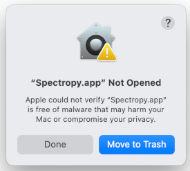

Spectropy
=========

Spectropy is a simple tool to view, compare and match Raman and infrared spectra of
minerals.

Install
-------

### MacOS

On MacOS, Spectropy is available via Homebrew. Please install it as [described on their
website](https://brew.sh/). Usually, you should just need to open the Terminal
App and paste the following command:

    /bin/bash -c "$(curl -fsSL https://raw.githubusercontent.com/Homebrew/install/HEAD/install.sh)"

Once done, install Spectropy using the following commands:

    brew tap simonecnt/3dz2
    brew install spectropy

Spectropy will be available in you Application folder.

The first time you will try to open it, you will get a warning, like this:

Click "Done", then open the MacOS System Settings from the Apple menu on the top right, go to the 
Privacy & Security tab, and when you read "Spectropy.app was blocked to protect your Mac." click "Open Anyway".
After that, it Spectropy should open properly.

To upgrade Spectropy to a new version, open a Terminal and type:

    brew upgrade

And to uninstall Spectropy:

    brew uninstall spectropy

### Linux

Spectropy is a python application using tkinter for the graphical user
interface. You need first to install these via your Linux distribution 
package manager (apt, pacman, ...). The details depend on your operating
system. To verify that tkinter is available run this command in the Terminal:

    python3 -m tkinter

You should see a little window opening with the tkinter version. If instead you
get any error, it means something went wrong somewhere...

At this point you should have python and tkinter installed. you can now install
Spectropy via pip:

    pip3 install --user --upgrade https://github.com/SimoneCnt/spectropy/archive/refs/heads/main.zip

This command should install all needed dependences, and you should be able to
run Spectropy from the Terminal via:

    python3 -m spectropy

### Windows

No idea, I've never tested this. 

First Use
---------

  
*Figure: Main Spectropy window at first use.*

Upon opening Spectropy for the first time, you probably want to load a Raman
spectra you measured or received. For this, just click on the "Open New
Spectrum" button and navigate to the file you want to open. Spectropy currently
support Raman spectra in a few formats: spc, LRD 1.1, the format used by [the
RRUFF project](https://rruff.info/) and a plain text format. Spectropy tries to
automatically detect the format, but it may fail. If that happens, or if your
spectra is in a not supported format, please sent it to me, and I'll see what I
can do.

Once loaded you can change a few settings: 
 - Label: change the text in the legend.
 - Color: change the color!
 - Min and Max: limit the range of Raman shifts in the plot.
 - Shift: shift vertically the whole graph.
 - Filter: increase/decrease the number of peaks detected.
 - Baseline: compute and eventually remove a baseline correction; try to play
   with the L and P parameters to see what it "looks best".
 - Calibrate: m,q are two parameters to shift horizontally and scale the graph;
   this is useful in case your Raman spectrometer is not calibrated and a 
   simple linear regression may fix the issue (m is the slope, q the intercept
   of such linear regression). Click apply to see its effect.
 - Match: match the spectra with a database of reference spectra (see below).
 - Save: save a text file with the new spectra; useful when removing the
   baseline and calibrating it.
 - Remove: delete the current spectra.

  
*Figure: Spectropy window after loading a first spectrum.*

You can load multiple spectra at the same time, for comparisons. If you are
loading a lot of spectra you can save the current setup with the "Save config"
button. The "Load config" will reopen it as it was left. The "Update graph"
should be useless, as the graph should be updated every time your change any
parameter. In case you don't see  some setting being applied, try the "Update
graph" button. The buttons "RefLib Setup" and "RefLib View" allow you to load
and view the reference library, see description below.

Reference Library
-----------------

Raman spectroscopy is close to useless without a reliable database of reference
spectra. The [RRUFF project](https://rruff.info/) provides, free for everyone,
such reference database for minerals.

With the "RefLib Setup" button you can download and setup a copy of the RRUFF
database for use in Spectropy. First, you need to download it, so click on the
"Get new version" button. It will take a while, and, once done, it should show
the text "Last downloded:" with the current date. The RRUFF project regularly
update their database, so you may want to download a new fresh copy from time
to time (no idea how often, maybe every few months?).

  
*Figure: Setup of the Reference Library.*

With a copy of the RRUFF database you can now create a matching library to be
used to match your spectra with. You can select how many different spectra of
the same mineral you want (a couple should be enough, increase if you want),
and the preferred wavelength of the laser to use. Raman spectra can differ with
the used laser, so using as reference spectra obtained with the same laser
could help. If no spectra with your preferred laser are found, the closest ones
are selected instead. Then click the "Generate new matching library" button. It
will take again a little while, and, after that, it should show a text saying:
"Library available with max_spectra=x and preferred_laser=xxx".

You are now ready to go! Close to window and click the "RefLib View" button.
This will open a new window where you can select a mineral, then a laser
wavelength, and then a RRUFF ID. By clicking the RRUFF ID, that spectra will be
loaded in the main window. The number in square brackets is the "quality" of
the spectra as listed by RRUFF: 3 is high quality, 0 is low quality. This
library view will show all spectra available, not only the ones selected in the
generation of the matching library.

  
*Figure: View of the Reference Library once loaded.*

Matching a spectra
------------------

Once you have loaded a reference matching library you can click on the "Match"
button of your spectra and this will run 3 different matching algorithms. The
best matching spectra will be listed in a new window, and you can open any of
them by just clicking on them. 

This overall interface need to be improved... todo!

